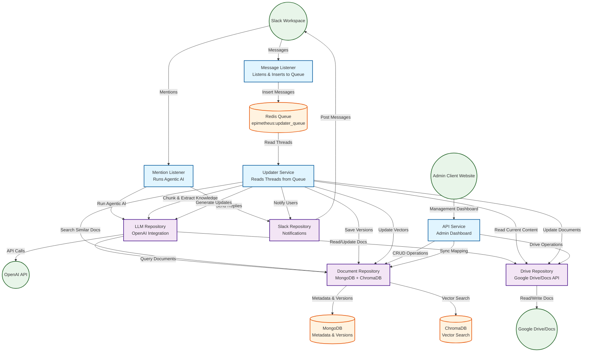
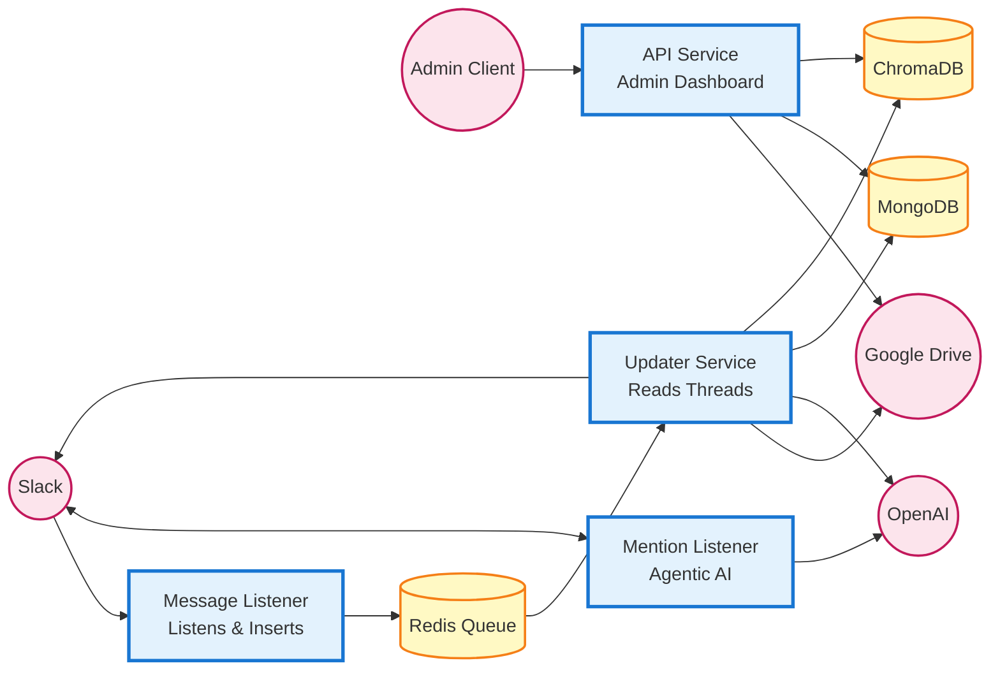

# Project Epimetheus: Slack-to-Docs RAG Bot

Epimetheus listens to Slack conversations, extracts new knowledge, and keeps Google Docs up to date. It uses RAG (ChromaDB + LLM) to route updates to the right document and stores version history in MongoDB.

## Components
- Message Listener (`services/bot/entry.py`): socket-mode Slack bot that listens to messages and inserts them into Redis queue.
- Mention Listener (`services/bot/handlers.py`): handles Slack mentions and runs agentic AI to process user queries and commands.
- Updater Service (`services/updater_service/entry.py`): reads threads from Redis queue, chunks messages, extracts knowledge, decides whether to update, writes to Google Docs, stores versions, updates vectors, and optionally notifies Slack.
- API Service (`services/api_service/entry.py` + `services/api_service/routes.py`): FastAPI app for admin client website, providing management dashboard and manual operations (list/search documents, sync Drive mapping, manage versions, health).
- Repository layer:
  - `repository/drive_repository.py`: Google Drive/Docs operations.
  - `repository/document_repository.py`: MongoDB metadata + versions, vector search, queue consumption, orchestration helpers.
  - `repository/llm_repository/*`: LLM prompts, document update generation, agent tools.
  - `repository/slack_repository.py`: Slack notifications.
- Shared utilities: `utils/db_utils.py` (Redis/Mongo/Chroma), `utils/message_utils.py`, `utils/logger.py`, `utils/constants.py`.

## System Architecture



## Abstract Service Architecture



## Data Flow
1. **Message Listener**: Listens to Slack messages and inserts them into Redis queue `epimetheus:updater_queue`.
2. **Mention Listener**: On Slack mention, runs agentic AI to process user queries and commands, queries documents, and sends replies directly.
3. **Updater Service**: Reads threads from Redis queue:
   - chunks messages, extracts knowledge with LLM,
   - chooses target doc via Chroma similarity + metadata,
   - reads current doc from Google Docs,
   - generates new content + change summary,
   - saves version to Mongo, writes partial update to Google Docs, refreshes vectors, optionally notifies Slack.
4. **API Service**: Provides admin dashboard and management interface for manual operations (mapping sync, document CRUD, version browse/revert, health).

## Running the services
### With Docker Compose
```bash
cp .env-example .env   # fill in tokens/keys/IDs
docker-compose up -d
```
Starts Redis, MongoDB, ChromaDB, and the Epimetheus app (message listener + mention listener + updater + API).

### Locally (without Docker)
```bash
pip install -r requirements.txt
cp .env-example .env   # fill in Slack, Google, OpenAI, DB config
python main.py         # runs message listener + mention listener + updater (thread) + API
```
Run individually:
```bash
python main.py bot      # runs message listener + mention listener
python main.py updater  # runs updater service
python main.py api      # runs API service
```

## Configuration (env vars)
- `SLACK_BOT_TOKEN`, `SLACK_APP_TOKEN` (socket mode).
- `GOOGLE_CREDENTIALS_PATH` (service account JSON), `GOOGLE_DRIVE_FOLDER_ID`.
- `OPENAI_API_KEY`, `OPENAI_BASE_URL` (optional), `OPENAI_MODEL` (default `gpt-4`).
- Redis: `REDIS_HOST`, `REDIS_PORT`, `REDIS_DB`.
- MongoDB: `MONGODB_HOST`, `MONGODB_PORT`, `MONGODB_DATABASE`, `MONGODB_USERNAME`, `MONGODB_PASSWORD`, `MONGODB_URI` (optional override).
- ChromaDB: `CHROMA_DB_PATH`, `CHROMA_HOST`, `CHROMA_PORT`, `CHROMA_USE_HTTP`.
- Tuning: `MESSAGE_CHUNK_SIZE`, `KNOWLEDGE_EXTRACTION_THRESHOLD`.

Place the Google service account JSON in the project root (or point `GOOGLE_CREDENTIALS_PATH` to it) and share the target Drive folder with the service account email.

## API overview (FastAPI - Admin Dashboard)
Base URL defaults to `http://localhost:8000`. The API Service provides endpoints for the admin client website and management dashboard.
- `GET /health` – service health.
- `GET /api/v1/status` – API status message.
- Documents: `GET /api/v1/documents`, `GET /api/v1/documents/search`, `POST /api/v1/documents`, `GET /api/v1/documents/{doc_id}`, `GET /api/v1/documents/{doc_id}/metadata`, `PUT /api/v1/documents/{doc_id}/metadata`, `GET /api/v1/documents/metadata/all`.
- Drive mapping: `GET /api/v1/drive/mapping`, `POST /api/v1/drive/mapping/sync`, `PUT /api/v1/drive/mapping/document`.
- Versions: `GET /api/v1/versions/{doc_id}`, `GET /api/v1/versions/{doc_id}/{version_id}`, `POST /api/v1/revert/{doc_id}/{version_id}`.
- Trigger check: `POST /api/v1/trigger` (verifies a doc exists; processing is otherwise automatic).

## Project structure
```
Epimetheus-Bot/
├── main.py
├── services/
│   ├── bot/                    # Slack bot
│   │   ├── app.py
│   │   ├── buffer.py
│   │   ├── entry.py
│   │   ├── handlers.py
│   │   └── ui.py
│   ├── updater_service/        # Redis consumer + update orchestration
│   │   ├── core.py
│   │   ├── entry.py
│   │   ├── intelligence.py
│   │   └── storage.py
│   └── api_service/            # API Service (Admin Dashboard)
│       ├── __init__.py
│       ├── entry.py
│       ├── routes.py
│       └── schemas.py
├── repository/
│   ├── drive_repository.py
│   ├── document_repository.py
│   ├── slack_repository.py
│   └── llm_repository/
│       ├── agentic.py
│       ├── core.py
│       ├── prompts.py
│       └── __init__.py
├── utils/
│   ├── constants.py
│   ├── db_utils.py
│   ├── logger.py
│   └── message_utils.py
├── tests/
│   ├── conftest.py
│   └── test_integration_drive_and_document_repo.py
├── Dockerfile
├── docker-compose.yml
├── requirements.txt
├── .env-example
└── README.md
```

## Testing

### Running End-to-End Tests

End-to-end tests require real connections to Google Drive, MongoDB, Redis, and OpenAI. Tests automatically load environment variables from your `.env` file.

**Prerequisites:**
1. Ensure you have a `.env` file configured (copy from `.env-example` and fill in values)
2. Required services must be running:
   - Redis (for message queue)
   - MongoDB (for document metadata and versions)
   - ChromaDB (for vector search, optional for some tests)
   - Google Drive API credentials configured
   - OpenAI API key configured (for agentic AI tests)

**Run all tests:**
```bash
pytest tests/ -v
```

**Run only end-to-end integration tests:**
```bash
pytest tests/test_e2e_services.py -v
```

**Skip integration tests (run only unit tests if any):**
```bash
pytest tests/ -m "not integration" -v
```

**Test Coverage:**
- **Google Drive Operations**: Create, list, search, read, and update documents
- **Google Document Operations**: Content management and partial updates
- **Document Repository**: Version management, syncing, and processing updates
- **Message Listener**: Message buffering and queue dispatch
- **Updater Service**: Redis queue consumption and document updates
- **Mention Listener**: Agentic AI processing and RAG-based Q&A
- **End-to-End Flow**: Complete message → queue → updater → document update workflow

**Note:** Tests will automatically skip if required services or credentials are not available. Make sure your `.env` file contains all necessary configuration values.

## Notes
- Message Listener and Mention Listener run together in the bot service (`python main.py bot`).
- The Mention Listener processes mentions immediately using agentic AI, while the Message Listener queues regular messages for batch processing.
- The Updater Service reads from the Redis queue and processes messages asynchronously.
- Drive mapping is synced automatically on startup via the updater/API; `/api/v1/drive/mapping/sync` is available for manual runs.
- Version history is stored in MongoDB and can be reverted via the API.
